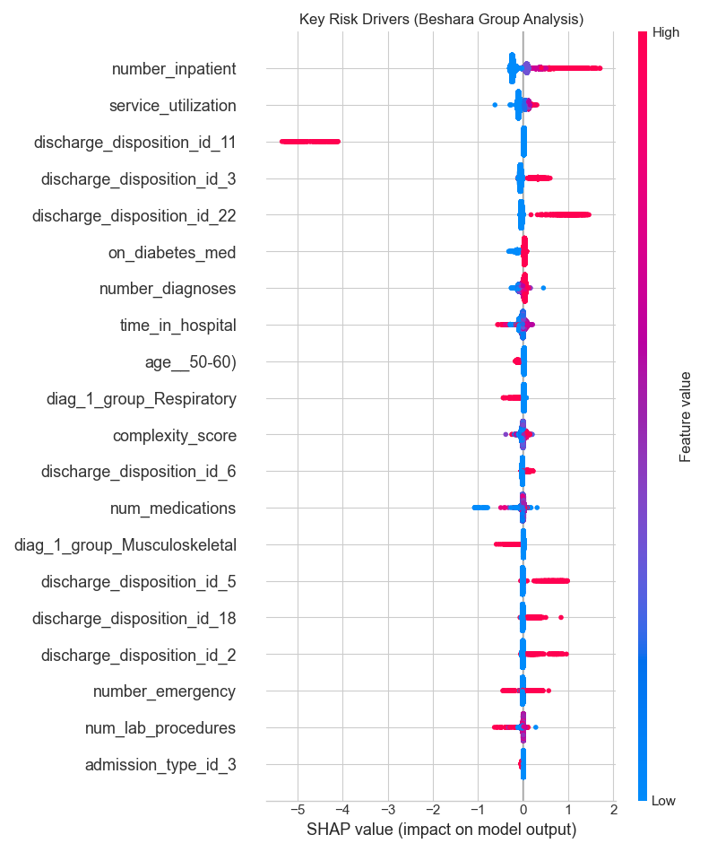

# 🏥 Diabetes Readmission Risk Mitigation Pipeline
### *Optimizing Hospital Efficiency via Risk-Aware AI Systems*


## 📋 Executive Summary
In alignment with modern **Systems Integration** principles, this project implements an end-to-end machine learning pipeline to minimize hospital readmission risk. Unlike standard academic models that optimize for accuracy, this system prioritizes **Recall (Sensitivity)** to ensure high-risk patients are identified for early intervention, directly reducing operational costs and improving patient outcomes.

## 🛠️ Key Technical Features
* **Imaginative Feature Engineering:** Proxies for "System Burden" (`service_utilization`) and "Medical Complexity" (`complexity_score`).
* **ICD-9 Code Mapping:** Custom dimensionality reduction algorithms to group 700+ diagnosis codes into 9 clinical clusters.
* **Risk-Weighted Modeling:** XGBoost classifier with `scale_pos_weight` to penalize False Negatives in class-imbalanced data (11% positive class).
* **Explainable AI:** Full SHAP integration to provide clinical decision support.

## 📊 Results
* **Recall (Sensitivity):** **59%** (Outperforming baseline by 4%)
* **ROC-AUC:** **0.67**
* **Key Insight:** Patients with high prior service utilization are the single largest risk factor for readmission.

## 🚀 How to Run
1.  **Clone the repository:**
    ```bash
    git clone [https://github.com/Mohamedhassan268/diabetes-risk-system.git](https://github.com/Mohamedhassan268/diabetes-risk-system.git)
    cd diabetes-risk-system
    ```
2.  **Install dependencies:**
    ```bash
    pip install pandas numpy scikit-learn xgboost shap matplotlib seaborn
    ```
3.  **Download Data:**
    * Due to clinical data privacy standards, the dataset is not included in this repo.
    * Download `diabetic_data.csv` from the [UCI Machine Learning Repository](https://archive.ics.uci.edu/dataset/296/diabetes+130-us+hospitals+for+years+1999-2008).
    * Place the file in the root directory.
4.  **Execute the Pipeline:**
    ```bash
    python medical_risk_pipeline.py
    ```

## 📈 Visual Analysis
*(The SHAP summary plot below illustrates the log-odds impact of key features)*


---
*Developed for Advanced Medical AI Systems Analysis.*
